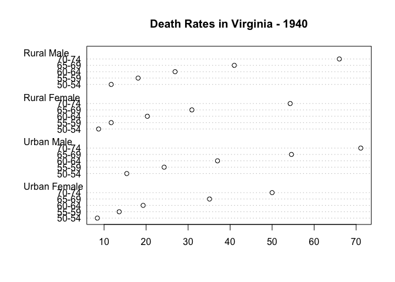

Markdown in .R
================
LBE
28 April, 2021

*Using markdown language in .R files instead of Markdown/notebooks*

## Why Markdown?

-   git
-   reproducability / transparency
-   legacy

## Why .R instead of .rmd?

*If you’re in analysis mode and want a report as a side effect, write an
R script. If you’re writing a report with a lot of R code in it, write
Rmd.*  
- .R code is top level, prose is second  
- .rmd prose is top level, code is second

## How does it work?

Major difference: the roxygen skeleton `#'`

``` r
# this reads as a normal commented text in a code chunk
```

this reads as text

Code chunks can still be controlled using `#+`, so
\`\`\``{r setup, include = FALSE}` becomes `#+ r setup, include = FALSE`

### Formatting

All the normal Markdown formatting works:  
- *italics*  
- **bold**

# heading1

## heading 2

## Rendering code

``` r
summary(VADeaths)
```

    ##    Rural Male     Rural Female     Urban Male     Urban Female  
    ##  Min.   :11.70   Min.   : 8.70   Min.   :15.40   Min.   : 8.40  
    ##  1st Qu.:18.10   1st Qu.:11.70   1st Qu.:24.30   1st Qu.:13.60  
    ##  Median :26.90   Median :20.30   Median :37.00   Median :19.30  
    ##  Mean   :32.74   Mean   :25.18   Mean   :40.48   Mean   :25.28  
    ##  3rd Qu.:41.00   3rd Qu.:30.90   3rd Qu.:54.60   3rd Qu.:35.10  
    ##  Max.   :66.00   Max.   :54.30   Max.   :71.10   Max.   :50.00

``` r
dotchart(VADeaths, main = "Death Rates in Virginia - 1940")
```

<!-- -->
