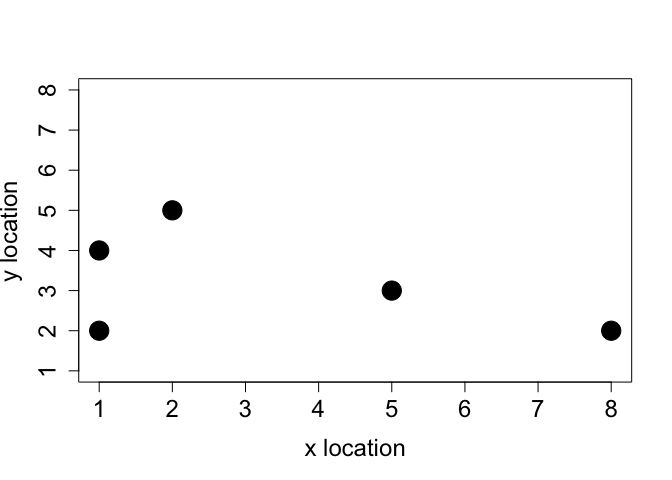

Getting started with IBMSs in R
================
LBE
21 January, 2020

Working thorugh the tutorial, while learning markdown (in R script), and
git…

<https://bradduthie.github.io/blog/individual-based-models-in-r/>

## First we define the individuals

``` r
# Individuals

inds = array(data = 0, dim = c(5, 3));
colnames(inds) = c("characteristic_1", "characteristic_2", "characteristic_3");
rownames(inds) = c("ind_1", "ind_2", "ind_3", "ind_4", "ind_5");
print(inds);
```

    ##       characteristic_1 characteristic_2 characteristic_3
    ## ind_1                0                0                0
    ## ind_2                0                0                0
    ## ind_3                0                0                0
    ## ind_4                0                0                0
    ## ind_5                0                0                0

``` r
# Change to interestng characters

colnames(inds) = c("body_mass", "x_loc", "y_loc");
```

Let us say that body mass is normally distributed around a value of 23
with a standard deviation of 3.

``` r
inds[, 1] = rnorm(n = dim(inds)[1], mean = 23, sd = 3);
```

We can now set individual x and y locations into columns 2 and 3,
respectively, by sampling from a vector of numbers 1 to 8 with
replacement (sampling with replacement ensures that more than one
individual can occupy the same x or y location).

``` r
inds[, 2] = sample(x = 1:8, size = dim(inds)[1], replace = TRUE);
inds[, 3] = sample(x = 1:8, size = dim(inds)[1], replace = TRUE);
```

We can even plot the individuals’ x and y locations to see how they are
spatially distributed.

``` r
plot(x = inds[,2], y = inds[,3], pch = 20, cex = 4, xlim = c(1, 8),
     ylim = c(1, 8), xlab = "x location", mar = c(5, 5, 1, 1),
     ylab = "y location", cex.lab = 1.5, cex.axis = 1.5);
```

<!-- -->

### …then we move them

To model random movement to any of the eight cells surrounding a focal
individual’s current location (thereby also allowing diagonal movement),
we can sample two random integer values from the set {−1,0,1} with
replacement and equal probability.

``` r
x_move     <- sample(x = c(-1, 0, 1), size = 1);
y_move     <- sample(x = c(-1, 0, 1), size = 1);
inds[1, 2] <- inds[1, 2] + x_move;
inds[1, 3] <- inds[1, 3] + y_move;
```

This was only one individual, but we can move all of the individuals
simultaneously according to our movement rule if we sample a vector of
x\_move and y\_move that matches the number of individuals in the
array.

``` r
x_move    <- sample(x = c(-1, 0, 1), size = dim(inds)[1], replace = TRUE);
y_move    <- sample(x = c(-1, 0, 1), size = dim(inds)[1], replace = TRUE);
inds[, 2] <- inds[, 2] + x_move;
inds[, 3] <- inds[, 3] + y_move;
```

### Now do it as a function…

To be especially vigilant, it is often a good idea to give each unique
process in an IBM its own function. There are at least three benefits of
coding this way. First, it will later allow us to test each process in
the IBM independently, so that if one part of the model does not appear
to be working as it should, then we can narrow down the problem more
easily by checking each function. Second, it makes it easier to change
the order of operations in our IBM (e.g., whether movement happens
before, or after, birth or death processes). Third, it makes the code
easier to read; rather than having to scan through all of the code at
once to understand a model, we can break things down piece by piece
(this will become clearer later).

``` r
movement <- function(inds, xloc = 2, yloc = 3){
  total_inds   <- dim(inds)[1]; # Get the number of individuals in inds
  move_dists   <- c(-1, 0, 1);  # Define the possible distances to move
  x_move       <- sample(x = move_dists, size = total_inds, replace = TRUE);
  y_move       <- sample(x = move_dists, size = total_inds, replace = TRUE);
  inds[, xloc] <- inds[, xloc] + x_move;
  inds[, yloc] <- inds[, yloc] + y_move;
  return(inds);
}

inds=movement(inds);
```

## Now, let’s simulate movement over time

We’re essentially calling the `movement` function multiple times, total
times steps is called `time_steps`

``` r
time_steps <- 20;
```

To run a simulation of individuals moving for twenty time steps, we now
need to use a loop. A while loop in which some variable ts (indicating
‘time step’) increases from 0 to 19 is probably the easiest way to
code the simulation.

``` r
ts <- 0; #start time step
while(ts < time_steps){
  inds <- movement(inds);
  ts   <- ts + 1; 
}
```

But how do we stop indiviudals from *falling off the map*? Common
options include
:

``` 
1. Place them back onto the boundary edge (i.e., a sticky landscape edge).  
2. Change their direction at the boundary edge (i.e., a reflecting landsacpe edge).  
3. Have them move to the opposite side of the landscape (i.e., a torus landscape with no edge)  
```

``` r
## Reflective edge

movement <- function(inds, xloc = 2, yloc = 3, xmax = 8, ymax = 8){
  total_inds   <- dim(inds)[1]; # Get the number of individuals in inds
  move_dists   <- c(-1, 0, 1);  # Define the possible distances to move
  x_move       <- sample(x = move_dists, size = total_inds, replace = TRUE);
  y_move       <- sample(x = move_dists, size = total_inds, replace = TRUE);
  inds[, xloc] <- inds[, xloc] + x_move;
  inds[, yloc] <- inds[, yloc] + y_move;
  
  # =========   The reflecting boundary is added below
  for(i in 1:total_inds){               # For each individual i in the array
    if(inds[i, xloc] > xmax){         # If it moved passed the maximum xloc
      inds[i, xloc] <- xmax - 1;    # Then move it back toward the centre
    }
    if(inds[i, xloc] < 1){            # If it moved below 1 on xloc
      inds[i, xloc] <- 2;           # Move it toward the centre (2)
    }
    if(inds[i, yloc] > ymax){         # If it moved passed the maximum yloc
      inds[i, yloc] <- ymax - 1;    # Then move it back toward the centre
    }
    if(inds[i, yloc] < 1){            # If it moved below 1 on yloc
      inds[i, yloc] <- 2;           # Then move it toward the centre (2)
    }
  } 
  # =========  Now all individuals should stay on the landscape
  return(inds);
}
```

let’s generate some new indidivuals

``` r
inds           <- array(data = 0, dim = c(5, 3));
colnames(inds) <- c("body_mass", "x_loc", "y_loc");
rownames(inds) <- c("ind_1", "ind_2", "ind_3", "ind_4", "ind_5");
inds[,1]       <- rnorm(n = dim(inds)[1], mean = 23, sd = 3);
inds[,2]       <- sample(x = 1:8, size = dim(inds)[1], replace = TRUE);
inds[,3]       <- sample(x = 1:8, size = dim(inds)[1], replace = TRUE);
```

and run the simulation again

``` r
ts         <- 0;
time_steps <- 20;
while(ts < time_steps){
  inds <- movement(inds);
  ts   <- ts + 1; 
}
print(inds);
```

    ##       body_mass x_loc y_loc
    ## ind_1  20.82992     3     6
    ## ind_2  25.88275     7     3
    ## ind_3  24.42194     4     6
    ## ind_4  23.59383     1     6
    ## ind_5  23.39410     2     5

how about if we want to reconstruct the movement patterns of each
individual and see how the whole population moves from time step 0 to
time step 20. In R, we can do this easily by creating a new list and
storing the `inds` array as a list element in each time step.

``` r
ts         <- 0;
time_steps <- 20;
inds_hist  <- NULL; # Here's the list
while(ts < time_steps){
  inds            <- movement(inds);
  ts              <- ts + 1; 
  inds_hist[[ts]] <- inds; # Add to list
}
print(inds);
```

    ##       body_mass x_loc y_loc
    ## ind_1  20.82992     7     1
    ## ind_2  25.88275     4     4
    ## ind_3  24.42194     2     2
    ## ind_4  23.59383     3     3
    ## ind_5  23.39410     6     6

The `inds_hist` list essentially stores the entire history of the
individuals moving over the course of the simulation. Storing this kind
of information is very useful for reconstructing the history of a
simulation to understand what is going on. As more biological processes
are added (e.g., birth, death, predation, etc.), we can effectively take
a perfect snapshot of each point in time in the system that we are
modelling.

But: this can get huge with lots of information…. so we then subset the
data with what we’re interested in…

We could, for example, see where individual 1 has been over the 20 time
steps by extracting the information from `inds_hist` and storing it in a
new table.

``` r
ind1_locs <- array(data = NA, dim = c(20, 3));
for(i in 1:20){
  ind1_locs[i, 1] <- i                     # Save the time step
  ind1_locs[i, 2] <- inds_hist[[i]][1, 2]; # xloc for the time step
  ind1_locs[i, 3] <- inds_hist[[i]][1, 3]; # yloc for the time step
}
colnames(ind1_locs) <- c("time_step", "x_loc", "y_loc");
print(ind1_locs);
```

    ##       time_step x_loc y_loc
    ##  [1,]         1     4     7
    ##  [2,]         2     5     6
    ##  [3,]         3     4     5
    ##  [4,]         4     5     6
    ##  [5,]         5     5     5
    ##  [6,]         6     5     5
    ##  [7,]         7     5     5
    ##  [8,]         8     6     5
    ##  [9,]         9     5     5
    ## [10,]        10     6     6
    ## [11,]        11     5     5
    ## [12,]        12     4     5
    ## [13,]        13     4     6
    ## [14,]        14     5     5
    ## [15,]        15     6     4
    ## [16,]        16     5     3
    ## [17,]        17     6     3
    ## [18,]        18     6     2
    ## [19,]        19     6     2
    ## [20,]        20     7     1

## Adding more parametres to the model

### Simulating individual birth

As a simplifying assumption, let us assume that all individuals in our
model are female, and that the number of birth events for an individual
Bi is sampled from a Poisson distribution with 0.5 expected offspring
per time step (recall that a Poisson distribution describes the number
of events occurring over a fixed interval of time),

> Bi~Poisson(lambda=0.5)

``` r
rpois(n = 5, lambda = 0.5); #sample for five individuals with λ=0.5,
```

    ## [1] 0 0 1 0 0

now store it in the model  
The simplest solution is to initialise our array of individuals (inds)
with another column, representing the number of offspring an individual
has produced at a given time step.

``` r
inds           <- array(data = 0, dim = c(5, 4));
colnames(inds) <- c("body_mass", "x_loc", "y_loc", "repr");
rownames(inds) <- c("ind_1", "ind_2", "ind_3", "ind_4", "ind_5");
inds[,1]       <- rnorm(n = dim(inds)[1], mean = 23, sd = 3);
inds[,2]       <- sample(x = 1:8, size = dim(inds)[1], replace = TRUE);
inds[,3]       <- sample(x = 1:8, size = dim(inds)[1], replace = TRUE);
```

We now have the added column `repr` for individual reproduction. We
could add some reproduction for each individual immediately by sampling
from `rpois` to add values to the fourth column, but for now I will
instead create a new function `birth` to both sample births for each
individual and add the new offspring at the same time. In the `birth`
function, each individual will first be assigned a number of offspring
with rpois, then these new offspring will be added to the array inds.

``` r
birth <- function(inds, lambda = 0.5, repr_col = 4){
  total_inds       <- dim(inds)[1]; # Get the number of individuals in inds
  ind_cols         <- dim(inds)[2]; # Total inds columns
  inds[, repr_col] <- rpois(n = total_inds, lambda = lambda); #how many offspring has each individual produced
  total_off        <- sum(inds[, repr_col]); #calculating total number of offspring to be added to inds
  
  # ---- We now have the total number of new offspring; now add to inds
  new_inds     <- array(data = 0, dim = c(total_off, ind_cols)); #new array with total_offs rows (one for each new ofspring), and ind_cols columns
  new_inds[,1] <- rnorm(n = dim(new_inds)[1], mean = 23, sd = 3); #new body mass (shouldn't it be constarined as low though, since they are newborn?)
  new_inds[,2] <- sample(x = 1:8, size = dim(new_inds)[1], replace = TRUE); #new x-loc
  new_inds[,3] <- sample(x = 1:8, size = dim(new_inds)[1], replace = TRUE); #new y-loc
  # ---- Our new offspring can now be attached in the inds array
  inds <- rbind(inds, new_inds); #new inds added to old inds (but avoid using rbind for large datasets, it's very slow)
  return(inds);
}
```

not sure I understand this part (how is it odfferent from the `rbind`
above??). OH ok, I think I’ve got it - the `inds` in the model and the
`inds` array are not the same? The one in the function only exists in
there, so the fucnstion output needs to be merged with other output?
“What has happend above is that we have read `inds` into the function
`birth` and stored the output into an (overwritten) `inds` with the new
individuals in the array.”

``` r
inds <- birth(inds = inds);
#inds=NULL
ts         <- 0;
time_steps <- 10;
inds_hist  <- NULL; #clear the list from old stuff
while(ts < time_steps){
  inds            <- movement(inds);
  inds            <- birth(inds);
  ts              <- ts + 1; 
  inds_hist[[ts]] <- inds;
}
```

let’s track the location of individual 1

``` r
ind1_locs <- array(data = NA, dim = c(10, 3));
for(i in 1:10){
  ind1_locs[i, 1] <- i                     # Save the time step
  ind1_locs[i, 2] <- inds_hist[[i]][1, 2]; # xloc for the time step
  ind1_locs[i, 3] <- inds_hist[[i]][1, 3]; # yloc for the time step
}
colnames(ind1_locs) <- c("time_step", "x_loc", "y_loc");
print(ind1_locs);
```

    ##       time_step x_loc y_loc
    ##  [1,]         1     5     7
    ##  [2,]         2     4     6
    ##  [3,]         3     3     6
    ##  [4,]         4     3     5
    ##  [5,]         5     2     5
    ##  [6,]         6     1     4
    ##  [7,]         7     2     4
    ##  [8,]         8     3     5
    ##  [9,]         9     4     4
    ## [10,]        10     5     4

let’s pull out the abundance of individuals

``` r
ind_abund <- array(data = NA, dim = c(10, 2));
for(i in 1:10){
  ind_abund[i, 1] <- i;                      # Save the time step
  ind_abund[i, 2] <- dim(inds_hist[[i]])[1]; # rows in inds_hist[[i]]
}
colnames(ind_abund) <- c("time_step", "abundance");
print(ind_abund);
```

    ##       time_step abundance
    ##  [1,]         1        10
    ##  [2,]         2        16
    ##  [3,]         3        25
    ##  [4,]         4        31
    ##  [5,]         5        54
    ##  [6,]         6        83
    ##  [7,]         7       124
    ##  [8,]         8       188
    ##  [9,]         9       278
    ## [10,]        10       429

but wait… this isn’t very ecologically realistic…population will just
keep on expanding exponentially

### Simulating individual death

Suppose we assume that each landscape cell has enough resources to feed
one individual for one time step. We might then write a function death
that causes mortality whenever there is more than one individual on the
same landscape cell. Because there are 8 × 8 = 64 total landscape cells,
the maximum possible population size of would then be 64. **but see
tutorial for other suggestions of modeling mortality** first let’s
generate some new clean data set of individuals…

``` r
inds           <- array(data = 0, dim = c(5, 5));
colnames(inds) <- c("body_mass", "x_loc", "y_loc", "repr", "death");
rownames(inds) <- c("ind_1", "ind_2", "ind_3", "ind_4", "ind_5");
inds[,1]       <- rnorm(n = dim(inds)[1], mean = 23, sd = 3);
inds[,2]       <- sample(x = 1:8, size = dim(inds)[1], replace = TRUE);
inds[,3]       <- sample(x = 1:8, size = dim(inds)[1], replace = TRUE);
```

Then lets write a `death`
function:

``` r
death <- function(inds, xlen = 8, ylen = 8, dcol = 5, xcol = 2, ycol = 3){
  for(xdim in 1:xlen){      # For each row `xdim` of the landscape...
    for(ydim in 1:ylen){  # For each col `ydim` of the landscape... [ydim is just an aribtrary name of each step in forloop, can be anything, but can be recalled inside function]
      # Get the total number of individuals on the landscape cell
      on_cell <- sum( inds[, xcol] == xdim & inds[, ycol]  == ydim);
      # Only do something if on_cell is more than one
      if(on_cell > 1){
        # Get all of the occupants (by row number) on the cell
        occupants <- which(inds[, xcol] == xdim & inds[, ycol] == ydim);
        # Sample all but one random occupant to die
        rand_occ  <- sample(x = occupants, size = on_cell - 1);
        # Then add their death to the last column of inds
        inds[rand_occ, dcol] <- 1;
      }
    }
  }
  return(inds);
}
```

now lets test it:

``` r
inds[2, 2] <- inds[1, 2]; # Individiual 2 now in same x location as 1
inds[2, 3] <- inds[1, 3]; # Individiual 2 now in same y location as 1
inds[3, 2] <- inds[1, 2]; # Individiual 3 now in same x location as 1
inds[3, 3] <- inds[1, 3]; # Individiual 3 now in same y location as 1

inds <- death(inds = inds);
print(inds);
```

    ##       body_mass x_loc y_loc repr death
    ## ind_1  24.62130     8     2    0     0
    ## ind_2  18.74126     8     2    0     1
    ## ind_3  24.75647     8     2    0     1
    ## ind_4  22.87342     2     2    0     0
    ## ind_5  27.16715     4     1    0     0

lets only retain living individuals

``` r
inds <- inds[inds[, 5] == 0,]; # Retains individuals that did not die
print(inds);
```

    ##       body_mass x_loc y_loc repr death
    ## ind_1  24.62130     8     2    0     0
    ## ind_4  22.87342     2     2    0     0
    ## ind_5  27.16715     4     1    0     0

now let’s add everything together

``` r
inds           <- array(data = 0, dim = c(5, 5));
colnames(inds) <- c("body_mass", "x_loc", "y_loc", "repr", "death");
rownames(inds) <- c("ind_1", "ind_2", "ind_3", "ind_4", "ind_5");
inds[,1]       <- rnorm(n = dim(inds)[1], mean = 23, sd = 3);
inds[,2]       <- sample(x = 1:8, size = dim(inds)[1], replace = TRUE);
inds[,3]       <- sample(x = 1:8, size = dim(inds)[1], replace = TRUE);
```

``` r
ts         <- 0;
time_steps <- 20;
inds_hist  <- NULL;
while(ts < time_steps){
  inds            <- movement(inds);
  inds            <- birth(inds);
  inds            <- death(inds);
  inds            <- inds[inds[, 5] == 0,]; # Retain living
  ts              <- ts + 1; 
  inds_hist[[ts]] <- inds;
}
```

this is now a working IBM\! Use the same code as before to summarise how
pop abundance has changed over time:

``` r
ind_abund <- array(data = NA, dim = c(20, 2));
for(i in 1:20){
  ind_abund[i, 1] <- i;                      # Save the time step
  ind_abund[i, 2] <- dim(inds_hist[[i]])[1]; # rows in inds_hist[[i]]
}
colnames(ind_abund) <- c("time_step", "abundance");
print(ind_abund);
```

    ##       time_step abundance
    ##  [1,]         1         8
    ##  [2,]         2        13
    ##  [3,]         3        19
    ##  [4,]         4        26
    ##  [5,]         5        28
    ##  [6,]         6        29
    ##  [7,]         7        30
    ##  [8,]         8        39
    ##  [9,]         9        40
    ## [10,]        10        39
    ## [11,]        11        37
    ## [12,]        12        37
    ## [13,]        13        39
    ## [14,]        14        45
    ## [15,]        15        36
    ## [16,]        16        42
    ## [17,]        17        43
    ## [18,]        18        43
    ## [19,]        19        44
    ## [20,]        20        44

## Predator prey dynamics

We can re-use much of the code

``` r
pred           <- array(data = 0, dim = c(5, 5));
colnames(pred) <- c("body_mass", "x_loc", "y_loc", "repr", "death");
rownames(pred) <- c("pred_1", "pred_2", "pred_3", "pred_4", "pred_5");
pred[,1]       <- rnorm(n = dim(pred)[1], mean = 23, sd = 3);
pred[,2]       <- sample(x = 1:8, size = dim(pred)[1], replace = TRUE);
pred[,3]       <- sample(x = 1:8, size = dim(pred)[1], replace = TRUE);
```

It would be reasonable to assume that birth and death are both affected
by how successful a predator is at acquiring prey, so perhaps we only
want predators to survive and breed if they have eaten some fixed number
of times.

For simplicity, I will assume that predators that **eat at least one
prey in inds survive** to the next time step, while predators that **eat
two prey reproduce**. I will further assume that predators **cannot eat
more than two prey** in a time step, and that predators that **fail to
eat die**.

..Point out that thinking about the order in which events occur in an
IBM is important, and therefore should be considered carefully. It is
often good to change the order of events to see how it affects
simulation results. For now, I will assume that predators get to move,
eat, and reproduce after prey give birth but before prey die.

``` r
pred <- movement(pred); # movement is the same as `ind`
```

We now need a function that checks to see how many prey are located on a
predator’s landscape cell.

  - If that number is zero, then the predator should *die*.  
  - If that number is greater than zero, then the predator should
    *survive*.  
  - And if that number is greater than one, then the predator should
    *reproduce*.

We also need to make sure that the eaten prey are removed from `inds` so
that they do not reproduce, or are tagged in some way so that they can
be removed in the `death`
function.

``` r
predation <- function(pred, inds, xcol = 2, ycol = 3, rcol = 4, dcol = 5){
  predators   <- dim(pred)[1]; # Predator number
  pred[, dcol] <- 1;           # Assume dead until proven otherwise
  pred[, rcol] <- 0;           # Assume not reproducing until proven otherwise
  for(p in 1:predators){       # For each predator (p) in the array
    xloc   <- pred[p, xcol]; # Get the x and y locations
    yloc   <- pred[p, ycol];
    N_prey <- sum( inds[, xcol] == xloc & inds[, ycol] == yloc); #count number of prey in cell
    # ----- Let's take care of the predator first below
    if(N_prey > 0){
      pred[p, dcol] <- 0;  # The predator lives
    }
    if(N_prey > 1){
      pred[p, rcol] <- 1;  # The predator reproduces
    }
    # ----- Now let's take care of the prey
    if(N_prey > 0){ # If there are some prey, find them
      prey <- which( inds[, xcol] == xloc & inds[, ycol] == yloc);
      if(N_prey > 2){ # But if there are more than 2, just eat 2
        prey <- sample(x = prey, size = 2, replace = FALSE); #pull out two random from prey present in cell
      }
      inds[prey, dcol] <- 1; # Record the prey as dead
    }
  } # We now know which inds died, and which prey died & reproduced
  
  # ---- Below removes predators that have died
  pred         <- pred[pred[,dcol] == 0,] # Only survivors now left
 
   # ----- Below adds new predators based on the reproduction above    
  pred_off     <- sum(pred[, rcol]);
  new_pred     <- array(data = 0, dim = c(pred_off, dim(pred)[2]));
  new_pred[,1] <- rnorm(n = dim(new_pred)[1], mean = 23, sd = 3);
  new_pred[,2] <- sample(x = 1:8, size = dim(new_pred)[1], replace = TRUE);
  new_pred[,3] <- sample(x = 1:8, size = dim(new_pred)[1], replace = TRUE);
  pred         <- rbind(pred, new_pred);
 
   # ----- Now let's remove the prey that were eaten
  inds         <- inds[inds[,dcol] == 0,]; # Only living prey left
  
  # Now need to return *both* the predator and prey arrays
  pred_prey <- list(pred = pred, inds = inds);
  return(pred_prey);
}
```

\#WHOA\!\!

Now let’s test it by placing individuals and predators in known
locations, to see if predation happens as intended

``` r
inds           <- array(data = 0, dim = c(6, 5));
colnames(inds) <- c("body_mass", "x_loc", "y_loc", "repr", "death");
inds[,1]       <- rnorm(n = dim(inds)[1], mean = 23, sd = 3);
inds[1:3, 2]   <- 1; # x location
inds[1:3, 3]   <- 1; # y location
inds[4:5, 2]   <- 2; 
inds[4:5, 3]   <- 1; 
inds[6, 2]     <- 3; 
inds[6, 3]     <- 1; 

pred           <- array(data = 0, dim = c(4, 5));
colnames(pred) <- c("body_mass", "x_loc", "y_loc", "repr", "death");
pred[,1]       <- rnorm(n = dim(pred)[1], mean = 23, sd = 3);
pred[1, 2]     <- 1; # x location
pred[1, 3]     <- 1; # y location
pred[2, 2]     <- 2;
pred[2, 3]     <- 1;
pred[3, 2]     <- 3;
pred[3, 3]     <- 1;
pred[4, 2]     <- 4;
pred[4, 3]     <- 1;

# now simulate...
pred_prey <- predation(inds = inds, pred = pred);
inds      <- pred_prey$inds;
pred      <- pred_prey$pred;
```

## Now lets put it all together
